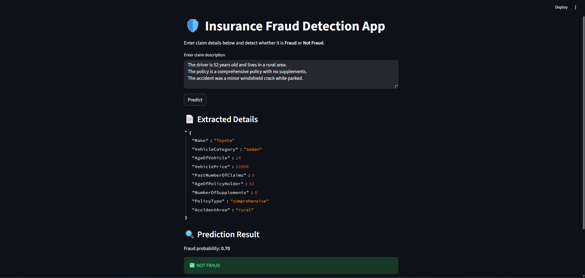

# Insurance Fraud Detection System

An AI powered fraud detection system combining:
- Machine Learning (XGBoost)
- LLM-based feature extraction (OpenRouter)
- Streamlit UI
- FastAPI backend (optional)

## Features
- Natural language claim input
- Automated feature extraction using LLM
- Fraud probability prediction
- Threshold-based decision logic
- Clean UI with real-time results

## Screenshots

### Fraud Case


### Not Fraud Case


## Tech Stack
- Python
- XGBoost
- Pandas / Scikit-learn
- OpenRouter API
- Streamlit
- FastAPI

### Train model
```bash
python train_fraud_model.py
