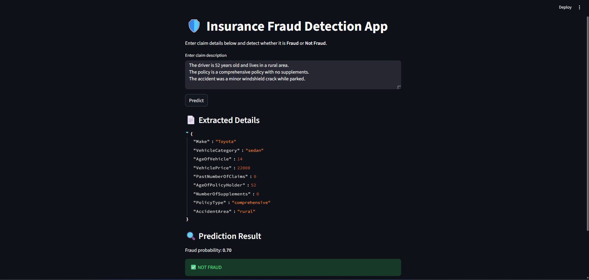

# Insurance Fraud Detection System
 
Describe a car insurance claim in plain english and get a fraud probability.
 
- XGBoost classifier trained on a car insurance claims dataset
- LLM feature extraction through OpenRouter (plain `openai` client, or LangChain via `EXTRACTOR=langchain`)
- Streamlit UI
- FastAPI backend

## Features
- Natural language claim input
- Automated feature extraction using LLM
- Fraud probability prediction
- Threshold-based decision logic
- Clean UI with real-time results

## Screenshots

### Fraud Case


### Not Fraud Case



## Setup
 
```bash
pip install -r backend/requirements.txt
cp backend/.env.example backend/.env   # then paste your OpenRouter key
```
 
Put the dataset at `ml-streamlit/dataset-carclaims.csv`, then:
 
```bash
cd ml-streamlit
python train_fraud_model.py     # creates fraud_model.pkl, feature_columns.pkl, categories.json
streamlit run app.py
```
 
Optional API:
 
```bash
cd backend
uvicorn main:app --reload       # POST /predict  {"text": "..."}
```
 
## How it works
 
1. `train_fraud_model.py` one-hot encodes the 9 features, trains XGBoost, and saves the allowed values of every feature to `categories.json`.
2. `fraud_detection.py` asks the LLM to fill each field using only those allowed values, snaps the answer to the nearest valid category, builds the exact training-format row, and applies a probability threshold.
3. `app.py` / `backend/main.py` expose it.
